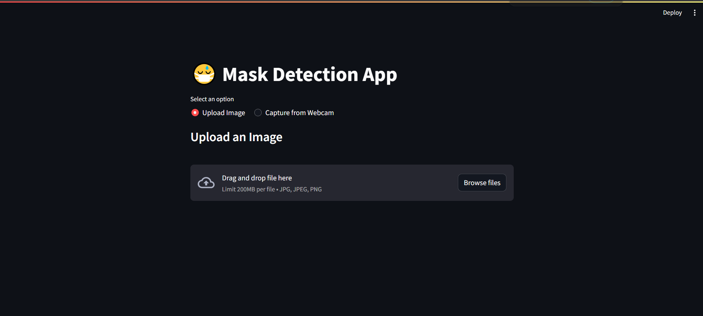
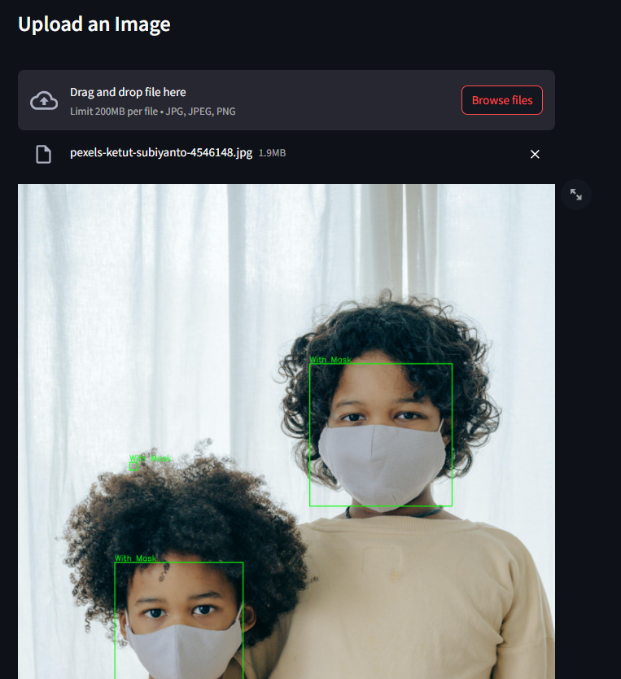
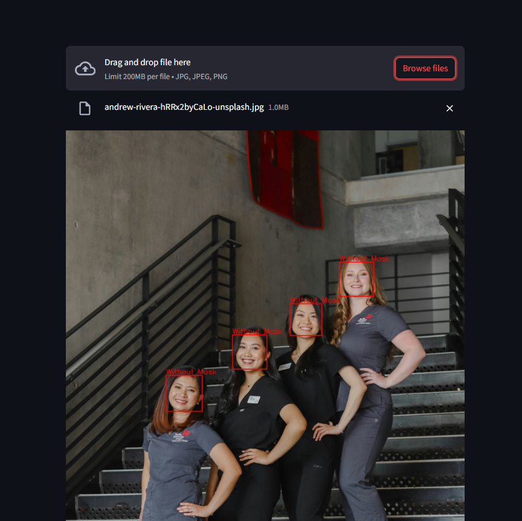

# 😷 Automated COVID-19 Mask Monitoring System

This repository contains the code and implementation for an advanced **COVID-19 Mask Detection System**. The goal of this project is to monitor mask compliance in real-time, ensuring public safety during the pandemic. With state-of-the-art model accuracy and a user-friendly interface, this system provides an efficient solution for mask detection.

---

## 🌟 Project Highlights

### 🎥 Real-Time Mask Detection Interface

---
### 🖼️ Sample Output of Mask Detection

---
### 🖼️ Sample Output of Without Mask Detection

---
- **Accuracy:** Achieved an impressive **98%** accuracy with a **0.08 error rate** on the validation dataset.
- **Model Architecture:** Utilized **TensorFlow** for designing and implementing advanced model architecture.
- **Transfer Learning:** Leveraged pre-trained models to improve model performance, achieving **98% accuracy** on the test dataset.
- **Real-Time Detection:** Developed a **real-time mask detection system** with a user-friendly frontend using **Streamlit**.

---

## 🛠️ Technologies Used
- **TensorFlow With CNN** Designed the deep learning architecture for mask detection using a Convolutional Neural Network (CNN).
- **Transfer Learning:** Used pre-trained models like `MobileNetV2`,`VGG16 `  to enhance accuracy and reduce training time.
- **Streamlit:** Built a user-friendly web application to monitor mask compliance in real-time.
- **OpenCV:** Integrated real-time Image feed for mask detection.
  
---

## 📊 Model Performance
- **Training Accuracy:** 98%
- **Test Accuracy:** 97%
- **Real-Time Detection Accuracy:** 97%
- **Error Rate:** 0.08

---

## 📂 Repository Structure
```plaintext
├── data/                    # Dataset folder
├── models/                  # Saved model files
├── app.py                   # Streamlit application file
├── requirements.txt         # Required dependencies
├── README.md                # Project documentation
```
---

## 🚀 Features
- Real-Time Detection: Automatically detects whether a person is wearing a mask in a live Webcam stream.
- Transfer Learning: Enhanced the model by using pre-trained architectures for improved accuracy.
- User-Friendly Interface: The entire system is accessible through a Streamlit web application, allowing users to monitor mask compliance effortlessly.

---
## ⚙️ How to Run

- Clone this repository:
```
git clone https://github.com/your-username/mask-detection-system.git
```
- Install the required dependencies:
```
pip install -r requirements.txt
```
- Run the Streamlit app:
```
streamlit run app.py
```
Access the real-time mask detection system through the generated local URL.
